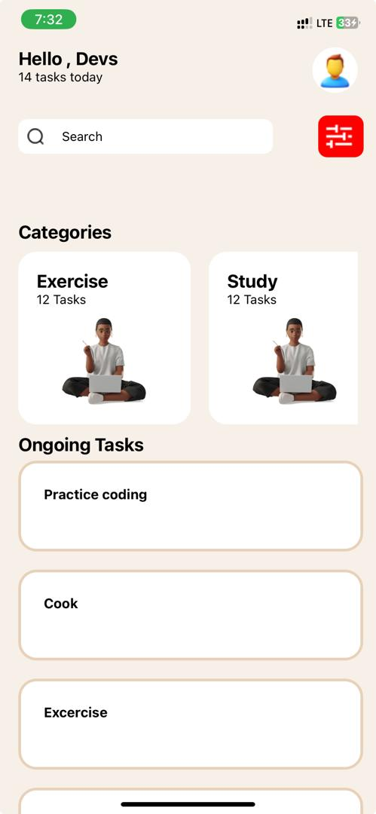

# rn-assignment3-11245046

## 11245046

### Frame1

The `Frame1` component structures a layout with text and an image using React Native's `<View>`, `<Text>`, and `<Image>` components. It arranges content horizontally, with text displayed in one section and an image in another. Styles define the layout and appearance of each element for a cohesive design.

### Searchbar

The `SearchBar` component creates a search interface in React Native, featuring an input field and a button. The input field allows users to enter search queries, while an icon aids in visual recognition. Styled containers ensure a clean layout, with the button offering a touchable interface for initiating searches.

### ActivityBox

The `ActivityBox` component in this React Native snippet organizes and displays categories of activities using a horizontal scrollable list. It utilizes the `FlatList` component to render each category item dynamically. Each category is presented within a styled container, showcasing the category name, the number of tasks associated with it, and an accompanying image. The horizontal layout ensures efficient navigation through the categories, enhancing user experience. Styled elements contribute to a visually appealing presentation, making it an effective component for displaying and selecting activity categories within mobile applications.

### OngoingTasks

The `OngoingTasks` component presents a list of ongoing tasks in a vertical layout. Each task is displayed within a styled container, showcasing the task name. The list is generated dynamically using the `map` function to iterate over the `tasks` array, rendering each task item. Styled elements contribute to a visually appealing presentation, enhancing the readability and organization of ongoing tasks within the application.

## Screenshot

